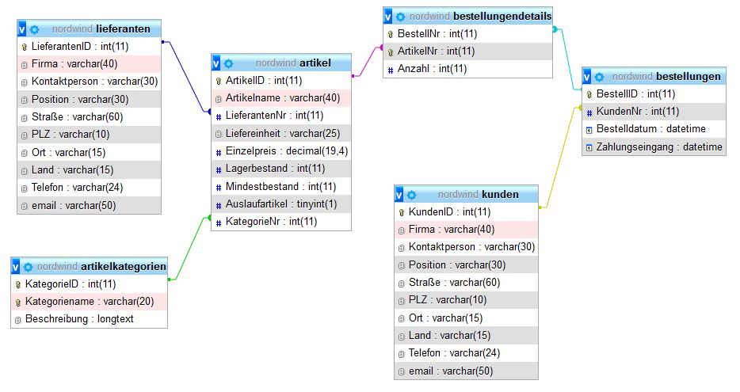

# Aufgaben SQL-Datenbank `nordwind`



## 1a)

### 1

Geben Sie alle Kundenadressen, sortiert nach Firma, aus.

```sql
SELECT Firma, Straße, PLZ, Ort, Land
FROM kunden
ORDER BY Firma;
```

### 2

Suchen Sie nun alle Kunden aus Brasilien, geben Sie die Liste sortiert nach Orten aus.

```sql
SELECT Firma, Straße, PLZ, Ort, Land
FROM kunden
WHERE Land = "Brasilien"
ORDER BY Ort;
```

### 3

Wieviele Kunden haben wir in den USA?

```sql
SELECT COUNT(*) 
FROM kunden
WHERE Land = "USA";
```

### 4

In welchen Orten wohnen die USA-Kunden? Schaffen Sie es, dass jeder Ort nur einmal ausgegegen wird?

```sql
SELECT DISTINCT Ort 
FROM kunden
WHERE Land = "USA";
```

### 5

Wieviele Kunden haben wir insgesamt?

```sql
SELECT COUNT(*) 
FROM kunden;
```

### 6

Welche Kunden haben wir in den Weltstädten Rom, San Francisco und Münster?

```sql
SELECT * 
FROM kunden
WHERE Ort IN ("Rom", "San Francisco", "Münster");
```

### 7

Geben Sie die Artikel nach Preis sortiert aus.

```sql
SELECT *
FROM artikel
ORDER BY Einzelpreis;
```

### 8

Geben Sie eine Liste aus, in der für jeden Artikel Nettopreis, Mwst-Aufschlag und Bruttoendpreis angeben ist.

```sql
SELECT 
  Artikelname, 
  Einzelpreis, 
  Einzelpreis *0.19 AS MwstAufschlag, 
  Einzelpreis *1.19 AS BruttoEndPreis
FROM artikel
ORDER BY Einzelpreis;
```

### 9

Was kostet der `GRAVAD LAX`?

```sql
SELECT Artikelname, Einzelpreis
FROM artikel
WHERE Artikelname = "GRAVAD LAX";
```

### 10

Wieviel "Matjeshering" ist auf Lager?

```sql
SELECT *
FROM artikel
WHERE Artikelname LIKE "%hering%";
```

### 11

Welche Artikel kosten weniger als 10 €?

```sql
SELECT Artikelname, Einzelpreis
FROM artikel
WHERE Einzelpreis < 10;
```

### 12

Was kosten `Wimmers gute Semmelknödel` und wieviel ist davon auf Lager?

```sql
SELECT Artikelname, Einzelpreis, Mindestbestand
FROM artikel
WHERE Artikelname = "Wimmers gute Semmelknödel";
```

### 13

Bei welchem (`Lieferanten`) arbeitet `Lars Peterson`?

```sql
SELECT Firma, Kontaktperson
FROM lieferanten
WHERE Kontaktperson = "Lars Peterson";
```

### 14

Wieviele Bestellungen gab der Kunde mit der Kundennummer 4 auf?

```sql
SELECT COUNT(*) 
FROM bestellungen 
WHERE KundenNr = 4;
```

### 15

Wieviele Bestellungen gab es im Jahr 2004? (ggf. wählen Sie ein anderes passendes Jahr gemäß Ihrer Datenbank)

```sql
SELECT COUNT(*) 
FROM bestellungen 
WHERE year(Bestelldatum) = 2004;
```

## 1b)

### 1

Welche Orte (aus `kunden`) fangen mit einem `B` an?

```sql
SELECT * 
FROM kunden
WHERE Ort LIKE "B%";
```

### 2

Wieviele Kunden wohnen in Orten, die mit `A` anfangen?

```sql
SELECT * 
FROM kunden
WHERE Ort LIKE "A%";
```

### 3

Welche Kunden wohnen im Postleitzahlenbereich 10

Ausgabe sortiert nach `Plz`, `Ort`?

```sql
SELECT * 
FROM kunden
WHERE PLZ LIKE "10%"
ORDER BY PLZ, Ort;
```

### 4

Welche Artikel enthalten den Begriff `ost`?

```sql
SELECT * 
FROM artikel
WHERE Artikelname LIKE "%ost%";
```

### 5

Geben Sie zu jedem Artikel den Lieferanten aus!

```sql
SELECT DISTINCT Artikelname, Firma 
FROM artikel 
    INNER JOIN lieferanten ON LieferantenNr = LieferantenId;
```

### 6

Geben Sie zu jedem Artikel den Kategorienamen aus!

```sql
SELECT  Artikelname, Kategoriename
FROM artikel, artikelkategorien
WHERE KategorieId = KategorieNr;
```

### 7

Geben Sie zu jedem Artikel den Kategorienamen und den Lieferanten aus!

```sql
SELECT  Artikelname, Kategoriename, Firma
FROM artikel, artikelkategorien, lieferanten
WHERE KategorieId = KategorieNr
  AND LieferantenId = LieferantenNr;
```

### 8

Geben Sie die Bestellnummern (der Bestellungen) aus für `Gravad Lax`!

```sql
SELECT BestellNr, Artikelname
FROM artikel, bestellungendetails
WHERE ArtikelID = ArtikelNr
  AND Artikelname="Gravad Lax";
```

### 9

In welche Länder lieferten wir Gewürze?

```sql
SELECT  Land, Kategoriename
FROM artikelkategorien, artikel, bestellungendetails, bestellungen, kunden
WHERE KategorieId = KategorieNr
  AND ArtikelId = ArtikelNr
  AND BestellNr = BestellId
  AND KundenNr = KundenId
  AND KategorieName LIKE "%rze%";
```

### 10

Folgende Abfrage ist gegeben:

```sql
SELECT sum(Lagerbestand * Einzelpreis) FROM Artikel;
```
Was sagt Ihnen das Ergebnis?

-> Summe aller `Artikel * Einzelpreis` (Inventur)

## 2a)

### 1

Welcher Artikel wurde am meisten (mengenmäßig) geordert?

```sql
SELECT ArtikelId, Artikelname, 
    sum(Anzahl) "Anzahl bestellt"
FROM bestellungendetails
    INNER JOIN artikel ON ArtikelNr = ArtikelId
GROUP BY Artikelid, Artikelname
ORDER BY 3 DESC
LIMIT 1;
```

alternativ:
```sql
SELECT ArtikelId, Artikelname, 
    sum(Anzahl) "Anzahl bestellt"
FROM bestellungendetails, artikel
WHERE  ArtikelNr = ArtikelId
GROUP BY ArtikelId, Artikelname
ORDER BY 3 DESC
LIMIT 1;
```


### 2

Wieviel Umsatz wurde mit diesem Artikel (aus 1.) gemacht?

```sql
SELECT ArtikelId, Artikelname, 
    max(Anzahl) "Anzahl bestellt",
    sum(Anzahl * Einzelpreis) "Umsatz"
FROM bestellungendetails
    INNER JOIN artikel ON ArtikelNr = ArtikelId
WHERE Artikelname = "Camembert Pierrot"
GROUP BY  Artikelid, Artikelname
ORDER BY 4 DESC;
```

alternativ
```sql
SELECT ArtikelId, Artikelname, 
    sum(Anzahl) "Anzahl bestellt",
    sum(Anzahl * Einzelpreis) "Umsatz"
FROM bestellungendetails, artikel
WHERE ArtikelNr = ArtikelId
  AND Artikelname = "Camembert Pierrot"
GROUP BY  Artikelid, Artikelname
ORDER BY 4 DESC;
```


### 3

Erstellen Sie jeweils eine Abfrage und ermitteln Sie darin die Umsätze 

Lösen Sie zur Übung je 3 Abfragen mit Equi-Join und 3 Abfragen mit Inner Join.

- je Kunde (Ausgabe `Firma`, `Ort`) 
  ```sql
  SELECT Firma, Ort,
      sum(Anzahl * Einzelpreis) "Umsatz je Kunde"
  FROM kunden
      INNER JOIN bestellungen ON KundenId = KundenNr
      INNER JOIN bestellungendetails ON BestellId = BestellNr
      INNER JOIN artikel ON ArtikelNr = ArtikelId
  GROUP BY Firma, Ort
  ORDER BY 3 DESC;
  ```

  alternativ:
  ```sql
  SELECT Firma, Ort,
      sum(Anzahl * Einzelpreis) "Umsatz je Kunde"
  FROM kunden, bestellungen, bestellungendetails, artikel
  WHERE KundenId = KundenNr 
      AND BestellId = BestellNr
      AND ArtikelNr = ArtikelId
  GROUP BY Firma, Ort
  ORDER BY 3 DESC;
  ```

- pro Artikel (`Artikelname`) 
  ```sql
  SELECT Artikelname, 
      sum(Anzahl * Einzelpreis) "Umsatz pro Artikel"
  FROM artikel INNER JOIN bestellungendetails ON ArtikelId = ArtikelNr
  GROUP BY Artikelname
  ORDER BY 2 DESC;
  ```
  alternativ:
  ```sql
  SELECT Artikelname, 
      sum(Anzahl * Einzelpreis) "Umsatz pro Artikel"
  FROM artikel, bestellungendetails
  WHERE ArtikelId = ArtikelNr
  GROUP BY Artikelname
  ORDER BY 2 DESC;
  ```

- je Bestimmungsland (`kunden`) 
  ```sql
  SELECT Land,
      sum(Anzahl * Einzelpreis) "Umsatz pro Land"
  FROM kunden 
      INNER JOIN bestellungen ON KundenId = KundenNr
      INNER JOIN bestellungendetails ON BestellId = BestellNr
      INNER JOIN artikel ON ArtikelNr = ArtikelID
  GROUP BY Land
  ORDER BY 2 DESC;
  ```
  alternativ:

  ```sql
  SELECT Land,
      sum(Anzahl * Einzelpreis) "Umsatz pro Land"
  FROM kunden, bestellungen, bestellungendetails, artikel 
  WHERE KundenId = KundenNr
      AND BestellId = BestellNr
      AND ArtikelNr = ArtikelID
  GROUP BY Land
  ORDER BY 2 DESC;
  ```

- je Artikelkategorie (`Kategoriename`) 
  ```sql
  SELECT Kategoriename,
      sum(Anzahl * Einzelpreis) "Umsatz je Artikelkategorie"
  FROM bestellungendetails
      INNER JOIN artikel ON ArtikelNr = ArtikelID
      INNER JOIN artikelkategorien ON KategorieNr = KategorieId
  GROUP BY Kategoriename
  ORDER BY 2 DESC;
  ```

  alternativ:
  ```sql
  SELECT Kategoriename,
      sum(Anzahl * Einzelpreis) "Umsatz je Artikelkategorie"
  FROM bestellungendetails, artikel, artikelkategorien 
  WHERE ArtikelNr = ArtikelID
      AND KategorieNr = KategorieId
  GROUP BY Kategoriename
  ORDER BY 2 DESC;
  ```

- je Verkäufer (Name aus Personal) 

- nach Herkunftsland (aus `lieferanten`)
  ```sql
  SELECT Land,
      sum(Anzahl * Einzelpreis) "Umsatz je Land Zulieferer" 
  FROM lieferanten
      INNER JOIN artikel on LieferantenId = LieferantenNr
      INNER JOIN bestellungendetails on ArtikelId = ArtikelNr
  GROUP BY Land
  ORDER BY 2 DESC;
  ```

  alternativ:
  ```sql
  SELECT Land,
      sum(Anzahl * Einzelpreis) "Umsatz je Land Zulieferer" 
  FROM lieferanten, artikel, bestellungendetails
  WHERE LieferantenId = LieferantenNr
      AND ArtikelId = ArtikelNr
  GROUP BY Land
  ORDER BY 2 DESC;
  ```

### 4

Geben Sie den Umsatz der verschiedenen Artikel der Kategorien `Süßwaren` aus, nach Umsatz aufsteigend sortiert.

```sql
SELECT Kategoriename, Artikelname, 
    sum(Anzahl * Einzelpreis) "Umsatz je SüßwarenArtikel" 
FROM artikelkategorien 
    INNER JOIN artikel on KategorieId = KategorieNr
    INNER JOIN bestellungendetails ON ArtikelId = ArtikelNr
WHERE Kategoriename LIKE "%waren"
GROUP BY Artikelname, Kategoriename
ORDER BY 3;
```

alternativ:

```sql
SELECT Kategoriename, Artikelname, 
    sum(Anzahl * Einzelpreis) "Umsatz je SüßwarenArtikel" 
FROM artikelkategorien, artikel, bestellungendetails
WHERE KategorieId = KategorieNr
    AND ArtikelId = ArtikelNr
    AND Kategoriename LIKE "%waren"
GROUP BY Artikelname, Kategoriename
ORDER BY 3;
```

### 5

Geben Sie die Kunden (`Firma`, `Ort`, `Land`) an und dazu die Gesamtbestellmenge für das leckere `Sasquatch Ale`.

```sql
SELECT Firma, Ort, Land, Artikelname,
sum(Anzahl) "Gesamtbestellmenge"
FROM kunden 
    INNER JOIN bestellungen on KundenId = KundenNr
    INNER JOIN bestellungendetails ON BestellId = BestellNr
    INNER JOIN artikel on ArtikelNr = ArtikelId
WHERE Artikelname LIKE "%sasq%"
GROUP BY Firma, Ort, Land, Artikelname
ORDER BY 5 DESC;
```

alternativ:
```sql
SELECT Firma, Ort, Land, Artikelname,
    sum(Anzahl) "Gesamtbestellmenge"
FROM kunden, bestellungen, bestellungendetails, artikel
WHERE KundenId = KundenNr
    AND BestellId = BestellNr
    AND ArtikelNr = ArtikelId
    AND Artikelname LIKE "%sasq%"
GROUP BY Firma, Ort, Land, Artikelname
ORDER BY 5 DESC;
```

### 6

Geben Sie den Getränke-Umsatz aus, den wir in den einzelnen Ländern erzielt haben. (Also je `Land`)

```sql
SELECT Land, Kategoriename,
    sum(Anzahl * Einzelpreis) "GetränkeUmsatz" 
FROM kunden
    INNER JOIN bestellungen ON KundenId = KundenNr
    INNER JOIN bestellungendetails ON BestellId = BestellNr
    INNER JOIN artikel ON ArtikelNr = ArtikelId
    INNER JOIN artikelkategorien ON KategorieNr = KategorieId
WHERE Kategoriename LIKE "%Getränke%"
GROUP BY Land, Kategoriename
ORDER BY 3 DESC;
```

alternativ:
```sql
SELECT Land, Kategoriename,
    sum(Anzahl * Einzelpreis) "GetränkeUmsatz" 
FROM kunden, bestellungen, bestellungendetails, artikel, artikelkategorien
WHERE KundenId = KundenNr
    AND BestellId = BestellNr
    AND ArtikelNr = ArtikelId
    AND KategorieNr = KategorieId
    AND Kategoriename LIKE "%Getränke%"
GROUP BY Land, Kategoriename
ORDER BY 3 DESC;
```

### 7

Geben Sie den Umsatz pro Jahr aus.

```sql
SELECT year(Bestelldatum), 
    sum(Anzahl * Einzelpreis) "Umsatz pro Jahr"
FROM bestellungen 
    INNER JOIN bestellungendetails ON BestellId = BestellNr
    INNER JOIN artikel ON ArtikelNr = ArtikelId
GROUP BY year(Bestelldatum);
```

alternativ:
```sql
SELECT year(Bestelldatum), 
    sum(Anzahl * Einzelpreis) "Umsatz pro Jahr"
FROM bestellungen, bestellungendetails, artikel
WHERE BestellId = BestellNr
    AND ArtikelNr = ArtikelId
GROUP BY year(Bestelldatum);
```


### 8

Welchen Umsatz machten wir mit `Auslaufartikeln`?

```sql
SELECT Artikelname,
    (Anzahl * Einzelpreis) "Umsatz Auslaufartikel"
FROM artikel
    INNER JOIN bestellungendetails on ArtikelID = ArtikelNr
WHERE Auslaufartikel=1
GROUP BY Artikelname
ORDER BY 2;
```

alternativ:
```sql
SELECT Artikelname,
    (Anzahl * Einzelpreis) "Umsatz Auslaufartikel"
FROM artikel, bestellungendetails
WHERE ArtikelID = ArtikelNr
    AND Auslaufartikel=1
GROUP BY Artikelname
ORDER BY 2;
```

### 9

Geben Sie den Gummibärenverbrauch (bestellte Mengen) je `Land` pro Jahr aus!

```sql
SELECT Artikelname, Land,
    (Anzahl * Einzelpreis) "Umsatz je Land", 
    year(Bestelldatum) "Jahr"
FROM artikel
    INNER JOIN bestellungendetails on ArtikelId = ArtikelNr
    INNER JOIN bestellungen on BestellNr = BestellID
    INNER JOIN kunden on KundenNr = KundenId
WHERE Artikelname LIKE "%Gummi%"
GROUP BY Artikelname, Land;
```

### 10

Wieviel Umsatz machten wir im 2. Quartal 2003?

```sql
SELECT 
    sum(Anzahl * Einzelpreis) "Umsatz 2. Quartal"
FROM artikel
    INNER JOIN bestellungendetails on ArtikelId = ArtikelNr
    INNER JOIN bestellungen on BestellNr = BestellID
WHERE year(Bestelldatum) = 2003
AND month(Bestelldatum) > 6;
```
alternativ

```sql
SELECT 
    sum(Anzahl * Einzelpreis) "Umsatz 2. Quartal"
FROM artikel
    INNER JOIN bestellungendetails on ArtikelId = ArtikelNr
    INNER JOIN bestellungen on BestellNr = BestellID
WHERE Bestelldatum > "2003-06-30"
AND Bestelldatum < "2004-01-01";
```

## 3)

### 1

Welche Kunden haben keine Aufträge?

```sql
SELECT Firma, KundenID, BestellId
FROM kunden 
    LEFT JOIN bestellungen ON KundenId = KundenNr 
WHERE BestellId IS NULL;
```
alternativ
```sql
SELECT Firma, KundenID, BestellId
FROM kunden 
    LEFT JOIN bestellungen ON KundenId = KundenNr 
WHERE KundenId NOT IN 
    (
        SELECT KundenNr
        FROM bestellungen
    );
```

### 2

Zeigen Sie (nur!) die Ladenhüter auf, d.h. Artikel die nicht bestellt wurden.

```sql
SELECT ArtikelId, Artikelname, BestellNr
FROM artikel
    LEFT JOIN bestellungendetails ON ArtikelId = ArtikelNr  
WHERE BestellNr IS NULL;
```

### 3

Wer ist der letzte Kunde (im Alphabet)?

```sql
SELECT max(Firma)
FROM kunden;
```

### 4

Geben Sie alle Artikel und den dazugehörigen Umsatz für das Jahr 2005 aus

```sql
SELECT Artikelname, year(Bestelldatum) Jahr,
    sum(Anzahl * Einzelpreis) Umsatz
FROM artikel
    INNER JOIN bestellungendetails ON ArtikelID = ArtikelNr
    INNER JOIN bestellungen ON BestellNr = BestellId
WHERE year(Bestelldatum) = 2005
GROUP BY Artikelname
ORDER BY 3 DESC;
```

### 5

Geben Sie eine Liste der nachzubestellenden Artikel aus, das heißt der Lagerbestand ist kleiner als der Mindestbestand.

```sql
SELECT Artikelname, Lagerbestand, Mindestbestand
FROM artikel 
WHERE Lagerbestand < Mindestbestand;
```

### 6

Erweitern Sie die vorige Abfrage: Auslaufartikel werden nicht mehr nachbestellt und sind daher nicht mit in die Liste aufzunehmen.

```sql
SELECT Artikelname, Lagerbestand, Mindestbestand
FROM artikel 
WHERE Lagerbestand < Mindestbestand
    AND Auslaufartikel = 0;
```

### 7

Wurden Artikel aus Dänemark (Tabelle "Lieferanten") zu Kunden nach Brasilien geliefert?

```sql
SELECT Artikelname, lieferanten.Land LieferantenLand, kunden.Land KundenLand
FROM lieferanten
    INNER JOIN artikel ON LieferantenID = LieferantenNr
    INNER JOIN bestellungendetails ON ArtikelId = ArtikelNr
    INNER JOIN bestellungen ON BestellNr = BestellId
    INNER JOIN kunden ON KundenNr = KundenId
WHERE lieferanten.Land = "Dänemark"
    AND kunden.Land = "Brasilien";
```

### 8

In welchem Jahr machten wir den größten Umsatz mit Naturprodukten?

```sql
SELECT Kategoriename, year(Bestelldatum) Jahr, max(anzahl * Einzelpreis) "Umsatz"
FROM artikelkategorien
    INNER JOIN artikel ON KategorieId = KategorieNr
    INNER JOIN bestellungendetails ON ArtikelId = ArtikelNr
    INNER JOIN bestellungen ON BestellNr = BestellId
WHERE Kategoriename = "naturprodukte"
GROUP BY Kategoriename, Jahr
ORDER BY 3 DESC
LIMIT 1;
```

### 9

Wieviel Umsatz erzielten wir mit "Steeleye Stout" im Jahr 2004?

```sql
SELECT Artikelname, year(Bestelldatum) Jahr, (Anzahl * Einzelpreis) Umsatz
FROM artikel
    INNER JOIN bestellungendetails ON ArtikelId = ArtikelNr
    INNER JOIN bestellungen ON BestellNr = BestellId
WHERE year(Bestelldatum) = 2004
    AND Artikelname LIKE "%eye%"
GROUP BY Artikelname, year(Bestelldatum);
```

### 10

Geben Sie alle Artikel mit einem Umsatz von weniger als 2000€ aus.

```sql
SELECT Artikelname, sum(Anzahl * Einzelpreis) Umsatz
FROM artikel 
    INNER JOIN bestellungendetails ON ArtikelID = ArtikelNr
GROUP BY Artikelname
HAVING Umsatz < 2000;
```

### 11

Was liefert folgende Abfrage:

```sql
SELECT DISTINCT artikel.ArtikelId, artikel.Artikelname 
FROM artikel 
WHERE artikel.ArtikelId NOT IN 
    (SELECT DISTINCT ArtikelId 
     FROM artikel, bestellungendetails, bestellungen 
     WHERE ArtikelId = ArtikelNr 
        AND Bestellid = BestellNr 
        AND year(Bestelldatum) = 2005);
```
-> Welches Produkt wurde 2005 nicht bestellt?

## 4)

### 1

Eine neue Kundin wurde gewonnen: Das "Futterhaus" in 20093 Hamburg, Hafentreppe 2a". Ansprechpartnerin ist Susi Sorglos, Mailadresse `SuSo@futterhaus.hamburg`.

```sql
INSERT INTO kunden (Firma, PLZ, Ort, Straße, Kontaktperson, email )
VALUES (
        "Futterhaus", "20093", "Hamburg", "Hafentreppe 2a", 
        "Susi Sorglos", "suso@futterhaus.hamburg" 
       );
```

check:
```sql
SELECT * FROM `kunden` where firma = "Futterhaus";
```


### 2

Das "Outback Lager" und der "Geitost" werden demnächst aus dem Sortiment genommen und sind daher als Auslaufartikel zu markieren. (Auslaufartikel=1)

```sql
UPDATE artikel 
SET Auslaufartikel = 1
WHERE Artikelname = "Outback Lager"
	OR Artikelname = "Geitost";
```
alternativ
```sql
UPDATE artikel 
SET Auslaufartikel = 1 
WHERE Artikelname IN ("Outback Lager", "Geitost");
```

check
  ```sql
  SELECT Artikelname, Auslaufartikel
  FROM artikel
  WHERE Artikelname = "Outback Lager"
    OR Artikelname = "Geitost";
  ```

### 3

Bei unserem Lieferanten "PB Knäckebröd AB" ist jetzt Frau Lara Svensson die neue Ansprechpartnerin für uns zuständig.

```sql
UPDATE lieferanten
SET Kontaktperson = "Lara Svensson"
WHERE Firma = "PB Knäckebröd AB"
```
check
```sql
SELECT Firma, Kontaktperson
FROM lieferanten
Where Firma = "PB Knäckebröd AB";
```

### 4

Die Bestellung mit der ID 111 ist zu löschen… (aufpassen!)

1. 
  ```sql
  DELETE FROM bestellungendetails 
  WHERE BestellNr = 111;
  ```
2. 
  ```sql
  DELETE FROM bestellungen
  WHERE BestellId = 111;
  ```

check
  ```sql
SELECT *
FROM bestellungendetails
    RIGHT JOIN bestellungen on BestellId = BestellNr
WHERE BestellID Between 109 and 112;
  ```

### 5

Gestiegene Transportkosten zwingen uns, die Preise aller Artikel von Lieferanten aus Australien, Brasilien und den USA um 4,5 % anzuheben.

```sql
UPDATE artikel 
SET Einzelpreis = Einzelpreis * 1.045
WHERE LieferantenNr IN 
    (
        SELECT LieferantenId 
        FROM lieferanten 
        WHERE Land IN ("Brasilien","Australien", "USA")
    );
```
check
```sql
SELECT LieferantenId, Firma, Land, Artikelname, Einzelpreis
FROM lieferanten
	INNER JOIN artikel on LieferantenID = LieferantenNr
WHERE Land IN ("Brasilien", "Australien", "USA");
```

### 6

Die Lieferfirma „Lyngbysild“ senkt die Preise für ihre Artikel um 5%.

```sql
UPDATE artikel
SET Einzelpreis = Einzelpreis * 0.95
WHERE LieferantenNr = 
      (
          SELECT LieferantenId
          FROM lieferanten
        WHERE Firma = "Lyngbysild"
      );
```

check
```sql
SELECT Firma, Artikelname, Einzelpreis 
FROM artikel
    INNER JOIN lieferanten on LieferantenID = LieferantenNr
WHERE Firma = "Lyngbysild";
```

### 7

`New Orleans Cajun Delights` liefert uns 360 Kartons `Chef Anton's Gumbo Mix`, erhöhen Sie den Bestand entsprechend.

```sql
UPDATE artikel
SET Lagerbestand = Lagerbestand + 360
WHERE Artikelname = "Chef Anton's Gumbo Mix"
And LieferantenNr =
        (
            SELECT lieferantenId 
            FROM lieferanten
            WHERE Firma = "New Orleans Cajun Delights"
        );
```

check
```sql
SELECT LieferantenId, Firma, Artikelname, Lagerbestand 
FROM lieferanten
	  INNER JOIN artikel ON LieferantenNr = LieferantenID
WHERE Firma = "New Orleans Cajun Delights"
	  AND Artikelname = "Chef Anton's Gumbo Mix";;
```

#Als neuer Lieferant wurde die Firma `International Pommes Service (IPS)` aus Berlin (`Südafrika`) gewonnen, die Telefon von `Karl Toffel` ist die 0800 – 888 888. Tragen Sie die Daten entsprechend bei den Lieferanten ein.

```sql
INSERT INTO lieferanten (Firma, Land, Telefon, Kontaktperson)
VALUES ("International Pommes Service (IPS)", 
        "Südafrika", 
        "0800 – 888 888", 
        "Karl Toffel");
```
check
```sql
SELECT Firma, Land, Telefon, Kontaktperson 
FROM lieferanten  
WHERE Firma = "International Pommes Service (IPS)";
```

### 9

Wir nehmen neue Ware ins Sortiment auf! - Erstellen Sie die neue Kategorie "Home Decoration", das ist "Alles für ein hygge Zuhause" - Nehmen Sie 3 neue Artikel dazu ins Sortiment auf.

```sql
INSERT INTO artikelkategorien (Kategoriename, Beschreibung)
VALUES ("Home Decoration", "Alles für ein hygge Zuhause");

INSERT INTO artikel (Artikelname, Einzelpreis, KategorieNr)
VALUES ("My Hygge1", "11.90", "9");

INSERT INTO artikel (Artikelname, Einzelpreis, KategorieNr)
VALUES ("My Hygge2", "22.30", "9");

INSERT INTO artikel (Artikelname, Einzelpreis, KategorieNr)
VALUES ("My Hygge3", "33.79", "9");
```
check
```sql
SELECT Artikelname, Einzelpreis, Kategoriename, Beschreibung 
FROM artikel
      INNER JOIN artikelkategorien ON KategorieNr = KategorieId
ORDER BY KategorieId DESC
LIMIT 3;
```

### 10

Löschen Sie alle nicht bestellten Artikel.

```sql
DELETE FROM artikel
WHERE ArtikelID NOT IN
	  (
        SELECT ArtikelNr 
        FROM bestellungendetails
      );
```
check
```sql
SELECT Artikelname, BestellNr
FROM artikel
	  LEFT JOIN bestellungendetails ON ArtikelID = ArtikelNr
WHERE BestellNr IS NULL;
```

## Vorlesung

### 22.11

- Anzahl aller Artikel per Aggregatfunktion bestimmen
  ```sql
  SELECT COUNT(*) 
  FROM artikel;
  ```
- Anzahl aller Artikel per Aggregatfunktion bestimmen und Aliasnamen vergeben
  ```sql
  SELECT COUNT(*) as "Anzahl Artikel" 
  FROM artikel;
  ```
- Anzahl aller Kunden und Email-Adressen bestimmen
  ```sql
  SELECT count(*) as Anzahl, 
      count(email) as Email 
  FROM kunden;
  ```
- Aggregatfunktionen für alphabetisch kleinsten und größten `Ort`
  ```sql
  SELECT max(Ort), 
      min(Ort) 
  FROM kunden;
  ```
- Anzeige nur von bestimmten Spalten und Bedingungen (Nur Kunden aus Frankreich)
  ```sql
  SELECT Firma, Ort, Land 
  FROM kunden 
  WHERE Land = "frankreich";
  ```
- Verknüpfung von Bedingungen (Alle Kunden aus Deutschland <u>**und**</u> Frankreich)
  ```sql
  SELECT Firma, Ort, Land 
  FROM kunden 
  WHERE Land = "frankreich" 
      OR Land = "deutschland";
  ```
- Verknüpfung von Bedingungen (Alle Kunden aus Münster <u>**und**</u> Berlin)
  ```sql
  SELECT Firma, Ort, Land 
  FROM kunden 
  WHERE Ort IN ("münster", "berlin");
  ```
- Sortieren nach 1. Land absteigend und 2. nach Firma aufsteigend (default)
  ```sql
  SELECT Firma, Ort, Land
  FROM kunden 
  WHERE Land IN ("Frankreich", "deutschland", "usa") 
  ORDER BY Land DESC, Firma;
  ```
  
  alternativ mit Angabe der Spaltennummer statt Spaltennamen
  ```sql
  SELECT Firma, Ort, Land
  FROM kunden 
  WHERE Land IN ("Frankreich", "deutschland", "usa") 
  ORDER BY 3 DESC, 1;
  ```
  
### 23.11

- Alle Spalten anzeigen, sortieren nach `Einzelpreis`
  ```sql
  SELECT * 
  FROM artikel 
  ORDER BY Einzelpreis;
  ```
  absteigende Sortierung:
  ```sql
  SELECT * 
  FROM artikel 
  ORDER BY Einzelpreis DESC;
  ```
- Die 5 teuersten Artikel anzeigen
  ```sql
  SELECT * 
  FROM artikel 
  ORDER BY Einzelpreis DESC 
  LIMIT 5;
  ```
- Alle Artikel, deren `Einzelpreis` über 20€ liegt, absteigend sortieren
  ```sql
  SELECT * FROM artikel 
  WHERE Einzelpreis > 20
  ORDER BY Einzelpreis DESC;
  ```
- Alle Artikel, deren `Einzelpreis` zwischen 20€ <u>**und**</u> 50€ liegt, absteigend sortieren
  ```sql
  SELECT Artikelname, Einzelpreis
  FROM artikel 
  WHERE Einzelpreis >= 20
      AND Einzelpreis <= 50
  ORDER by Einzelpreis DESC;
  ```
  alternativ:
  ```sql
  SELECT Artikelname, Einzelpreis
  FROM artikel 
  WHERE Einzelpreis BETWEEN 20 AND 50
  ORDER by Einzelpreis DESC;
  ```
- Summe aller Kunden aus `USA`, für die <u>**auch**</u> eine Email hinterlegt ist
  ```sql
  SELECT COUNT(*) "Kunden aus USA", 
      COUNT(email) "mit Mail" 
  FROM kunden 
  WHERE Land = "USA";
  ```
- Alle Artikel (Tabelle `artikel`) mit den Lieferern (Tabelle `lieferanten`) mit `Equi-JOIN` anzeigen
  
  ```sql
  SELECT Artikelname, Einzelpreis, Lagerbestand, Firma
  FROM artikel, lieferanten
  WHERE LieferantenID = lieferantenNr;
  ```
- Ausgabe aller Firmen (`kunden`), die “Milchprodukte” (`artikelkategorien`) verkaufen 
  ```sql
  SELECT Firma, Artikelname, Kategoriename
  FROM artikelkategorien, artikel, bestellungendetails, bestellungen, kunden
  WHERE KategorieId = KategorieNr
      AND ArtikelId = ArtikelNr
      AND Bestellnr = BestellId
      AND KundenNr = KundenId
      AND Kategoriename LIKE "%milch%"
  ORDER BY 1;
  ```
- Ausgabe aller verkauften Artikel für "Blauer See Delikatessen" (`kunden`) 
  ```sql
  SELECT Artikelname, Firma
  FROM artikel, bestellungendetails, bestellungen, kunden
  WHERE ArtikelId = ArtikelNr
      AND BestellNr = BestellId
      AND KundenNr = KundenId
      AND Firma LIKE "%blau%";
  ```
  
### 24.11

- Anzeige aller Bestellungen für Kunden in Berlin mit `EQUI_JOIN`
  ```sql
  SELECT KundenId, Firma, Ort, BestellId 
  FROM kunden, bestellungen
  WHERE KundenId = KundenNr
      AND Ort = "Berlin";
  ```

  alternativ mit `INNER JOIN`
  ```sql
  SELECT KundenId, Firma, Ort, BestellId 
  FROM kunden INNER JOIN bestellungen ON KundenId = KundenNr
      AND Ort = "Berlin";
  ```
  Anzeige <u>**aller**</u> Datenfelder mit `LEFT JOIN `(Nicht nur die Schnittmenge)
  ```sql
  SELECT KundenId, Firma, Ort, BestellId 
  FROM Kunden LEFT JOIN Bestellungen ON KundenId = KundenNr
      AND Ort = "Berlin";
  ```
  Anzeige von einigen Kunden, Bedingungen nach `KundenId`
  ```sql
  SELECT KundenId, Firma, Ort, BestellId 
  FROM Kunden LEFT JOIN Bestellungen ON KundenId = KundenNr
  WHERE KundenID IN (1,22,23,57,58);
  ```
- Anzeige aller Bestellnummern (`bestellungendetails`) zu allen Artikeln (`artikel`)
  ```sql
  SELECT ArtikelId, Artikelname, BestellNr
  FROM artikel INNER JOIN bestellungendetails ON ArtikelId = ArtikelNr;
  ```
  Anzeige <u>**aller**</u> Datenfelder mit `LEFT JOIN `(Nicht nur die Schnittmenge)
  nach Anlegen eines neuen Artikels
  ```sql
  SELECT ArtikelId, Artikelname, BestellNr
  FROM artikel LEFT JOIN bestellungendetails ON ArtikelId = ArtikelNr
  ORDER BY 3;
  ```
- Verknüpfung von mehreren Tabellen in Kombination mit `LEFT JOIN` und `INNER JOIN`
  ```sql
  SELECT ArtikelID, Artikelname, Bestellnr 
  FROM (((artikel 
          LEFT JOIN bestellungendetails ON ArtikelId = ArtikelNr)
          Inner JOIN bestellungen ON BestellId = BestellNr)
          INNER JOIN kunden on KundenID = KundenNr)
  WHERE Artikelname = "Gravad lax";
  ```
- In welche Orte (`kunden`) wurde "Gravad Lax" verkauft
  ```sql
  SELECT ArtikelID, Artikelname, Firma, Ort 
  FROM artikel 
      INNER JOIN bestellungendetails on ArtikelId = ArtikelNr
      INNER JOIN bestellungen on BestellId = BestellNr
      INNER JOIN kunden on KundenId = KundenNr
  WHERE Artikelname = "Gravad lax";
  ```
- Auflistung aller Gewürze und Kunden
  ```sql
  SELECT ArtikelID, Artikelname, Firma, Ort, Kategoriename 
  FROM artikel 
      INNER JOIN artikelkategorien on KategorieNr = kategorieId
      INNER JOIN bestellungendetails on ArtikelId = ArtikelNr
      INNER JOIN bestellungen on BestellId = BestellNr
      INNER JOIN kunden on KundenId = KundenNr
  WHERE Kategoriename LIKE "%rze%";
  ```
  Liste verkürzen und sortiert nach Firma
  ```sql
    SELECT DISTINCT ArtikelID, Artikelname, Firma, Ort, Kategoriename 
    FROM artikel 
        INNER JOIN artikelkategorien on KategorieNr = kategorieId
        INNER JOIN bestellungendetails on ArtikelId = ArtikelNr
        INNER JOIN bestellungen on BestellId = BestellNr
        INNER JOIN kunden on KundenId = KundenNr
    WHERE Kategoriename LIKE "%rze%"
    ORDER by 1;
  ```
- Gesamtsumme aller verkauften Artikel
  ```sql
  SELECT sum(Anzahl * Einzelpreis) 
  FROM artikel, bestellungendetails
  WHERE ArtikelNr = ArtikelId;
  ```
- Gesamtsumme aller Umsätze pro Artikel mit Aggregatfunktion
  ```sql
  SELECT Artikelname, 
      sum(Anzahl * Einzelpreis) 
  FROM bestellungendetails INNER JOIN artikel
      ON ArtikelNr = ArtikelId
  GROUP BY Artikelname
  ORDER BY 2 DESC;
  ```
- Ausgabe der verkauften Mengen und des jeweiligen Umsatzes je Artikel
  durch Kombination von Aggregatfunktionen
  ```sql
  SELECT Artikelname, Einzelpreis, 
      sum(Anzahl) "Verkaufsmenge",
      sum(Anzahl*einzelpreis) "Umsatz"
  FROM bestellungendetails INNER JOIN artikel
  WHERE ArtikelNr = ArtikelId
  GROUP BY Artikelname, Einzelpreis
  ORDER BY 3 DESC;
  ```
- Gesamtumsatz je Kategorie
  ```sql
  SELECT Kategoriename,
      sum(Anzahl * Einzelpreis) "Umsatz je Kategorie"
  FROM bestellungendetails
      INNER JOIN Artikel ON ArtikelNr = ArtikelId
      INNER JOIN artikelkategorien ON KategorieId = KategorieNr
  GROUP BY  Kategoriename
  ORDER BY 2;
  ```
- Gesamtumsatz je Bestellung
  ```sql
  SELECT Bestellnr,
      sum(Anzahl * Einzelpreis) "Umsatz je Bestellung"
  FROM bestellungendetails
      INNER JOIN artikel on ArtikelNr = ArtikelId
  GROUP BY  BestellNr
  ORDER BY 2 DESC;
  ```
- Einzelne Umsätze für alle Artikel mit `tofu`
  ```sql
  SELECT BestellNr, Artikelname,
      sum(Anzahl * Einzelpreis) "Umsatz für Tofu je Bestellung"
  FROM bestellungendetails
      INNER JOIN artikel ON ArtikelNr = ArtikelId
  WHERE Artikelname LIKE "%tofu%"
  GROUP BY  BestellNr, Artikelname
  ORDER By 1;
  ```

### 27.11

- Umsätze pro Artikel anzeigen
  ```sql
  SELECT Artikelname, 
      sum(Anzahl * Einzelpreis) "Umsatz je Artikel"
  FROM artikel, bestellungendetails 
  WHERE ArtikelID = ArtikelNR
  GROUP BY Artikelname
  ORDER BY 2 DESC;
  ```
- Bedingungen für Aggregatfunktion mit `HAVING`

  Nur Umsätze für Artikel anzeigen, die über 10000 liegen 
  ```sql
  SELECT Artikelname, 
      sum(Anzahl * Einzelpreis) "Umsätze über 10000"
  FROM artikel, bestellungendetails 
  WHERE ArtikelID = ArtikelNR
  GROUP BY Artikelname
  HAVING sum(Anzahl * Einzelpreis) > 10000
  ORDER BY 2 DESC;
  ```

- Umsätze für alle Kunden, die mindestens 10000€ Umsatz haben
  ```sql
  SELECT  Firma,
    sum(Anzahl * Einzelpreis) Umsatz  
  FROM artikel, bestellungendetails, bestellungen, kunden 
  WHERE ArtikelID = ArtikelNR
      AND BestellNr = BestellId
      AND KundenNr = KundenId
  GROUP BY Firma
  HAVING sum(Anzahl * Einzelpreis) > 10000
  ORDER BY Umsatz;
  ```
- Anzeige  billigster Artikel
  ```sql
  SELECT Artikelname, Einzelpreis
  FROM artikel
  ORDER BY 2
  LIMIT 1;
  ```
- Anzeige teuerster Artikel
  ```sql
  SELECT Artikelname, Einzelpreis
  FROM artikel
  ORDER BY 2 DESC
  LIMIT 1;
  ```
- Anzeige teuerster und billigster Artikel (ohne Artikelname)
  ```sql
  SELECT min(Einzelpreis) Billigster,
      max(Einzelpreis) Teuerster
  FROM artikel
  ```
- teuerster und billigster Artikel mit SUB-SELECT 
  ```sql
  SELECT Artikelname, Einzelpreis
  FROM artikel
  WHERE Einzelpreis = 
          (SELECT min(Einzelpreis) FROM artikel)
      OR 
        Einzelpreis =
          (SELECT max(Einzelpreis) FROM artikel);
  ```
- Anzeige billigste und teuerste Gewürz
  ```sql
  SELECT Artikelname, KategorieNr, Einzelpreis
  FROM artikel
  WHERE KategorieNr = 
      (SELECT KategorieId FROM artikelkategorien WHERE Kategoriename = "gewürze")
  AND 
      (
        Einzelpreis = (
        SELECT min(Einzelpreis) 
        FROM artikel 
        WHERE KategorieNr = (
            SELECT KategorieId 
            FROM artikelkategorien 
            WHERE Kategoriename ="gewürze"))
  OR 
      Einzelpreis = (
        SELECT max(Einzelpreis) 
        FROM artikel 
        WHERE KategorieNr = (
            SELECT KategorieId 
            FROM artikelkategorien 
            WHERE Kategoriename ="gewürze"))
      )
  ORDER BY Einzelpreis;
  ```
  alternativ
  ```sql
  SELECT Artikelname, KategorieNr, Einzelpreis
  FROM artikel
    INNER JOIN artikelkategorien ON KategorieNr = KategorieID
  WHERE Kategoriename = "Gewürze"
    AND 
      Einzelpreis IN 
      (
        (SELECT min(Einzelpreis) 
          FROM artikel 
          WHERE KategorieNr = 
            (SELECT KategorieID 
              FROM artikelkategorien 
              WHERE Kategoriename ="gewürze")), 
        (SELECT max(Einzelpreis) 
          FROM artikel 
          WHERE KategorieNr = 
            (SELECT KategorieID 
              FROM artikelkategorien 
              WHERE Kategoriename ="gewürze"))
      )
  ORDER BY Einzelpreis;
  ```
